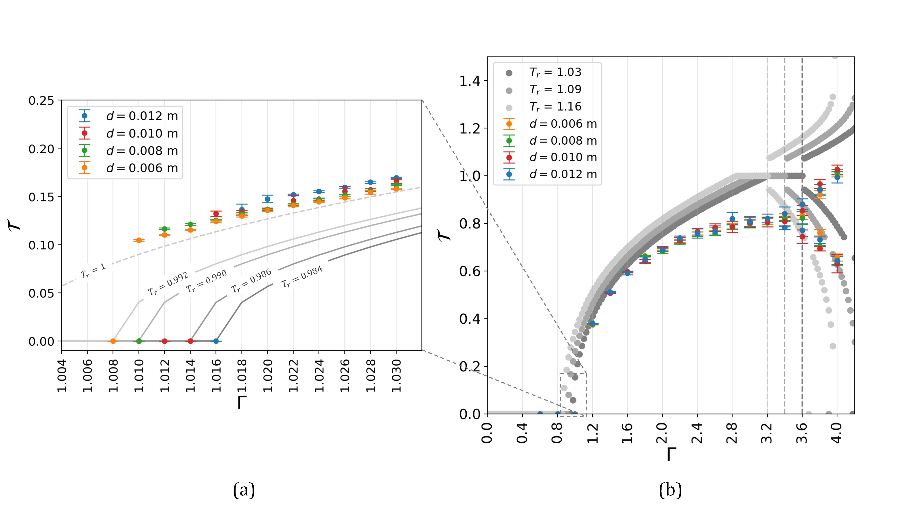

# LIGGGHTS DEM Simulation of Vibrated Granular System

## Overview

This project simulates the dynamics of monodisperse particles under vertical vibration using **LIGGGHTS DEM**, and analyzes the resulting motion using Python.

The study focuses on:

* Center of mass motion
* Particle flight times
* Collision dynamics under sinusoidal forcing

## Structure

* `simulation/` – LIGGGHTS input script and STL geometries
* `analysis/` – Python scripts for post-processing
* `data/` – (optional) output data

## Requirements

* LIGGGHTS (Ubuntu/Linux)
* Python 3
* NumPy, Pandas, Matplotlib

## How to Run

### 1. Run Simulation

```bash
liggghts < input_script.in
```

### 2. Run Analysis

```bash
python analysis.py
```

## Notes

* STL files define the container geometry
* Log files are parsed and converted into CSV for analysis
* Flight times are computed using peak detection and thresholding

## 🎥 Simulation Preview


## 📊 Sample Results

### Center of Mass Motion


Sample plot of the height versus time and the corresponding acceleration versus time of the CM of the granular materials for e = 0.50 at Γ = 6 [10]. The
orange dots are the points in time when collisions occurred, while the blue squares are when the materials are launched from the container. The yellow regions represent the duration of the flight times, and the red dashed line indicates when the grains are in free flight.

---

### Bifurcation of flight times


Bifurcation diagrams obtained from the dimensionless flight time T versus the dimensionless acceleration Γ for particle diameters d =[0.006, 0.008, 0.010, 0.012]
(a) zoomed-in at the critical accelerations and (b) a larger scale focusing on the first bifurcation. The theoretical bifurcation diagrams for various Tr are also plotted for comparison. Vertical dashed lines indicate the bifurcation point location on the Γ-axis.

## 🎥 Simulation Video

[](https://www.youtube.com/watch?v=1-3ROftmYsc)
